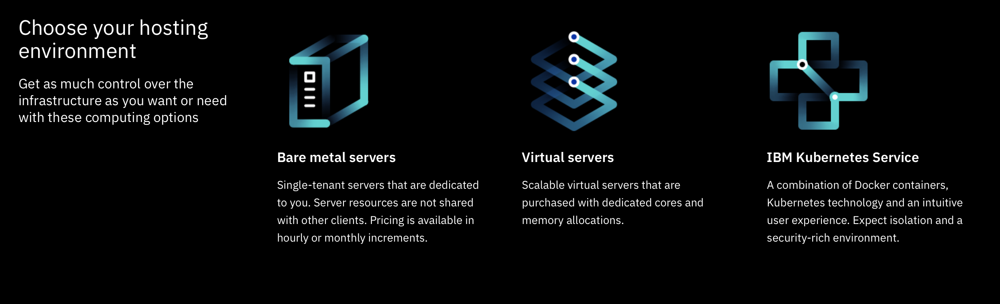
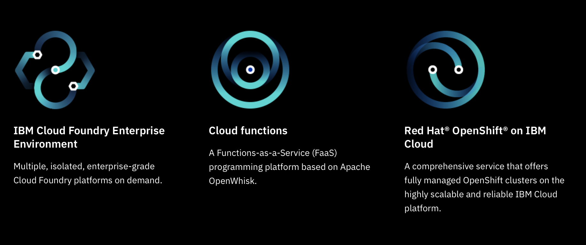
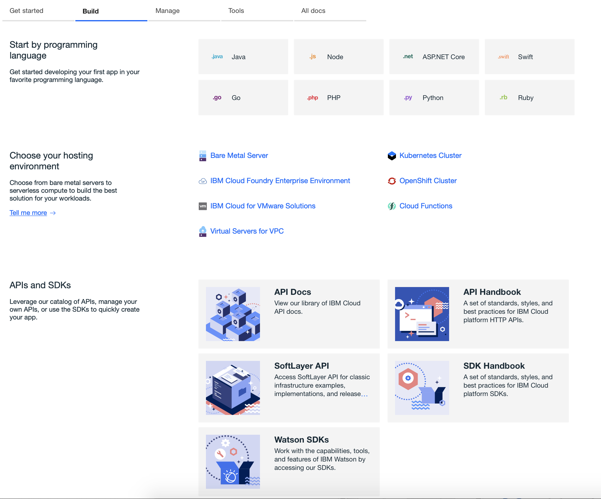

# ibmcloud2020

,img src="IBMCloud.png">

# Introduction: Benefits for startups in the IBM Cloud

Let’s start by looking ay what benefits IBM offers startups: https://developer.ibm.com/startups/:

To get into the “Builder” category you have to meet the following requirements:

Your business revenue in the last 12 months is less than $1M USD

Your business has been in business for fewer than five years

You have previously received no IBM technology credits

You are not a paying IBM Cloud customer

If you do meet those requirements you get the following benefits:

-> $1,000/month in IBM Cloud credits for one year

This is not bad and will most probably meet the requirements for a two-person startup with a typical seed funding of $1.1.

The startup would begin with using the IBM Free Lite account https://www.ibm.com/cloud/free/

Which will allow the startup to work with IBM’s AI services, Analytic Services and Data base services , development tools and security.

How much will the IBM Cloud Services add up to? Kunal Jasty has an interesting blog post on: How a 2 person startup already uses 28 other tools that gives a very good view in describing the costs for third-party tools outside of the Cloud Costs.
https://blog.acrossapp.com/how-a-2-person-startup-already-uses-28-other-tools/

IBM Light Account: https://youtu.be/T3hcBnkJYLw

A two-person startup with seed funding of around $1.1 would start with the IBM Cloud Lite Account which is free. They would then upgrade to a Pay-As-You-Go account. Many IBM Cloud products have a free Trial for Pay-As-You-Go accounts.

For cloud costs, we can look at the IBM Cloud Pricing list. And we must remember that as “Builders” we have $1,000/month in IBM Cloud credits for one year.

Then if you can can get accepted by an approved VC/accelerator/incubator and you’re working with innovative technologies like blockchain, AI and etc. you can get accepted into the Premier category where the benefits are: $10,000/month in IBM Cloud credits for up to one year.
And with that kind of money you can spin up pretty much what you want in the IBM Cloud.
If the two-person startup selected the IBM Cloud, chances are that they will be interested in Watson AI services of which there are 19 discrete services.

# IBM Cloud Datacenters. https://www.ibm.com/cloud/data-centers/

# IBM Cloud Status: https://cloud.ibm.com/status?selected=status

# IBM Learning Hub: https://www.ibm.com/cloud/learn

# Navigation: 

## Documentation:  https://cloud.ibm.com/docs       

## Catalog:  https://cloud.ibm.com/catalog

## Docs: https://cloud.ibm.com/docs

## Estimator: popup

## Login: https://cloud.ibm.com/login

## Sign up: https://cloud.ibm.com/registration

# Accounts:

## IBM Free Tier account https://www.ibm.com/cloud/free/

# IBM Cloud Foundry explained https://youtu.be/oUpqXxmr6oU

<a href="https://youtu.be/T3hcBnkJYLw">IBM Free Tier account</a>

# Chapter 5: Spinning up servers in the IBM Cloud

## IBM Cloud Bare Metal Servers https://www.ibm.com/cloud/bare-metal-servers

###  GPUs for Cloud Servers https://www.ibm.com/cloud/gpu

### GPUs explained: https://youtu.be/LfdK-v0SbGI

You asked. We listened. We’ve lowered our bare metal prices and included up to 20 TB of bandwidth. Same power and flexibility. New competitive prices. Simple as that. Explore IBM GPU options below.

## IBM Cloud Virtual Servers: https://www.ibm.com/cloud/virtual-servers

### What are virtual servers?

Virtual servers, also called virtual machines, are scalable and come with dedicated core and memory allocations. They’re a great option if you’re looking for compute resources that can be added in minutes, with access to features like image templates. The hypervisor is fully managed by the IBM Cloud™ and you can perform configuration and management tasks by using both the IBM Cloud client portal and the API. Virtual machines are deployed to the same VLANs as physical servers, enabling you to spread workloads across virtual servers and bare metal servers, while maintaining interoperability. Virtual servers are fully customizable when you order them, with options to scale as your compute needs grow.

When you create an IBM Cloud Virtual Server, you can choose between hourly and monthly billing. You can also choose between a multitenancy environment (public and transient) or a single-tenancy (dedicated) environment. Then, you can choose either high-performance local disks or enterprise SAN storage for your virtual machine

# AI Services https://cloud.ibm.com/catalog?category=ai

# AI Software  https://cloud.ibm.com/catalog?category=ai#software

# Documentation

## https://cloud.ibm.com/docs?tab=build

## https://cloud.ibm.com/apidocs

